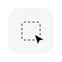

#  SimpleScreen

Скриншотер macOS, живущий в строке меню. Личный пет-проект — не предназначен для дистрибуции.

## Зачем

Стандартные хоткеи скриншотов в macOS (`⌘⇧3` / `⌘⇧4`) умеют либо записать PNG на рабочий стол, либо (с зажатым `Ctrl`) положить изображение в буфер обмена. **Одновременно сделать и то и другое — нельзя**: приходится либо лезть в Finder за файлом после копирования, либо вручную копировать сохранённый PNG, чтобы вставить его в чат/таск-трекер.

SimpleScreen решает именно эту задачу: режим **Save & Copy** (включён по умолчанию) одним хоткеем кладёт скриншот и в указанную папку, и в буфер обмена.

Дополнительно:

- настраиваемая папка сохранения;
- переопределяемые шорткаты с детекцией конфликтов с системными;
- автозапуск при логине через `SMAppService`;
- нет иконки в Dock — приложение живёт исключительно в строке меню.

## Обзор кода

**Точка входа**

- `SimpleScreenApp.swift` — `@main` SwiftUI App, подключает `AppDelegate`, скрывает Dock-иконку через `.accessory` activation policy.
- `AppDelegate.swift` — поднимает все сервисы, на старте проверяет разрешение Screen Recording, опрашивает систему на предмет его выдачи.

**Сервисы**

- `Preferences/AppSettings.swift` — `@Observable` единый источник истины для всех пользовательских настроек; читает/пишет `UserDefaults` по ключам с префиксом `ss_`.
- `HotKeys/HotKeyManager.swift` — обёртка над Carbon `RegisterEventHotKey`; держит ⌘⇧3 (полный экран) и ⌘⇧4 (область).
- `Notifications/NotificationManager.swift` — обёртка над `UNUserNotificationCenter`; показывает баннеры после каждого захвата.

**Захват**

- `Capture/CaptureEngine.swift` — `@Observable`; через `SCScreenshotManager` (ScreenCaptureKit) делает и полноэкранный, и региональный захват; в зависимости от `AppSettings.postCaptureAction` сохраняет в файл, кладёт в буфер обмена или делает и то, и другое; при ошибке записи в основную папку откатывается на `~/Desktop`.
- `Capture/AreaSelectionWindow.swift` — borderless `NSWindow` на уровне `.screenSaver` поверх основного дисплея; `SelectionView` обрабатывает выделение мышью с живым показом размеров в пикселях, отмену по Escape и гард на минимальный размер 10×10 пикселей.

**UI**

- `Menu/StatusBarController.swift` — владеет `NSStatusItem` (иконка камеры); собирает и держит выпадающее меню; реактивно обновляет key equivalents через `withObservationTracking`.
- `Preferences/PreferencesView.swift` — SwiftUI `Form` внутри плавающего `NSPanel`; настраивает post-capture action, папку сохранения, шорткаты (с детекцией конфликтов) и автозапуск.

**Поток данных**: `AppSettings` → за ним наблюдают `CaptureEngine`, `StatusBarController`, `PreferencesView`. Весь захват идёт через `CaptureEngine`. Все хоткеи — через `HotKeyManager`. Все нотификации — через `NotificationManager`. Никакой другой код не трогает ни `UserDefaults`, ни `SCScreenshotManager` напрямую.

## Требования

- Xcode 16+
- macOS 15.6+
- Apple Developer аккаунт (для подписи; для локальной сборки достаточно Personal Team).

## Сборка и запуск

1. Открыть `SimpleScreen.xcodeproj` в Xcode.
2. Выбрать схему `SimpleScreen` и Mac в качестве run destination.
3. Нажать **⌘R**.

После запуска приложение появляется в строке меню (иконка камеры). Dock-иконки нет.

### Разрешения при первом запуске

На первом старте приложение проверяет наличие разрешения Screen Recording:

- если оно уже выдано — приложение сразу готово к работе;
- если нет — показывается алерт с кнопкой **Open System Settings**. Выдать доступ нужно в **System Settings → Privacy & Security → Screen Recording**.
- приложение опрашивает систему раз в секунду — захват включится автоматически, как только разрешение появится, перезапуск не нужен.

## Использование

### Захват

| Действие | Пункт меню | Шорткат по умолчанию |
|----------|------------|----------------------|
| Захват всего экрана | Иконка камеры → Capture Full Screen | **⌘⇧3** |
| Захват выделенной области | Иконка камеры → Capture Selected Area | **⌘⇧4** |

**Выделение области**: поверх основного дисплея появляется crosshair-оверлей. Мышью растягивается прямоугольник, рядом с курсором в реальном времени показываются размеры в пикселях. По отпусканию кнопки — захват. **Escape** — отмена. Выделения меньше 10×10 пикселей отклоняются с предупреждающим баннером.

Если второй захват запущен в момент, когда уже идёт первый, он молча игнорируется.

### Что происходит после захвата

Настраивается в Preferences. Три режима:

| Режим | Что делает |
|-------|------------|
| Save to File | PNG записывается в указанную папку |
| Copy to Clipboard | Изображение кладётся в буфер обмена |
| Save & Copy (по умолчанию) | Делает и то и другое |

После каждого захвата показывается баннер-нотификация с результатом. Файлы именуются по шаблону `Screenshot YYYY-MM-DD at HH.MM.SS.png`. Если основная папка недоступна, приложение откатывается на `~/Desktop` и показывает алерт.

### Preferences

Открываются через **Иконка камеры → Preferences…**

- **Post-Capture Action** — выбор Save, Copy или обоих сразу.
- **Save Location** — кнопка **Choose…** позволяет указать любую папку; по умолчанию `~/Pictures/Screenshot/`.
- **Keyboard Shortcuts** — кнопка **Record** рядом с Full Screen или Area Select; нажимаете нужный шорткат; конфликты с системными комбинациями детектируются и показываются прямо в окне.
- **Launch at Login** — переключатель, регистрирующий/снимающий приложение в `SMAppService`.

Все настройки сохраняются между запусками.

## Логи

SimpleScreen пишет диагностику через macOS unified logging (`os.Logger`) — никаких файлов в `/tmp` или домашней директории не создаётся. macOS сам ротирует и устаревает журнал.

**Где смотреть**

- **Console.app**: открыть и ввести в поиске `subsystem:com.simplescreenapp.SimpleScreen`.
- **Терминал**: `log show --predicate 'subsystem == "com.simplescreenapp.SimpleScreen"' --debug --last 1h`

**Что логируется**

- Категория `capture` — события захвата: папка сохранения, размеры изображения, успешные записи в файл/буфер, ошибки.
- Категория `areaSelect` — события окна выделения: открытие/закрытие, перемещение мыши, отмена по Escape, слишком маленькое выделение.

**Уровни**

По умолчанию macOS показывает только `info` и `error`. Для подробной диагностики — флаг `--debug` для `log show` или **Action → Include Debug Messages** в Console.app.

## Дистрибуция

SimpleScreen собран под личное использование — нотаризованного релиз-пайплайна нет. Установка идёт напрямую из локально собранного `.app`:

1. Собрать Release в Xcode (**Product → Build** в Release-схеме, либо `xcodebuild -project SimpleScreen.xcodeproj -scheme SimpleScreen -configuration Release build`).
2. Перетащить `SimpleScreen.app` из `DerivedData/.../Build/Products/Release/` в `/Applications` (или `~/Applications`).
3. На первом запуске Gatekeeper может ругнуться: сборка использует ad-hoc локальную подпись (`Sign to Run Locally`). Правый клик → **Open** → подтвердить **Open** в диалоге. Один раз.
4. Выдать разрешение **Screen Recording** (System Settings → Privacy & Security → Screen Recording).

Особенности локальной подписи:

- **Launch at Login** через `SMAppService` для ad-hoc сборок может молча или громко не сработать — если так — баннер с ошибкой это покажет.
- Локальная подпись привязана к текущей ad-hoc identity на этой машине. После крупного апдейта macOS или сброса identity приложение, возможно, придётся пересобрать.
- **Не копировать** `SimpleScreen.app.dSYM` рядом с `.app` — это бандл с дебаг-символами, который Xcode кладёт рядом с бинарником (для символикации крэшей), а не часть приложения для пользователя. Локально можно безопасно удалять, он пересоздастся при следующей сборке.

Если когда-нибудь понадобится распространять проект на другие машины — переключаться на полный Developer ID-флоу: Archive → Developer ID sign → notarize (`xcrun notarytool`) → staple (`xcrun stapler staple`) → `ditto -c -k --keepParent SimpleScreen.app SimpleScreen.zip`.
